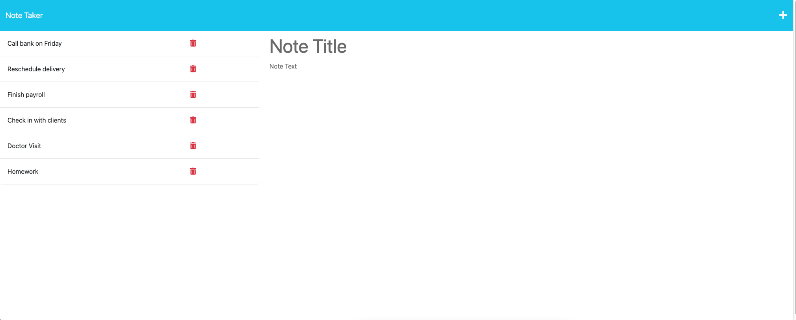

# Note Taker Application
       

  ## Description

This is a simple Note Taker application that allows small business owners to write and save notes to keep track of their tasks and organize their thoughts.

## License

## Link
Link to deployed application.
> https://desolate-journey-55866.herokuapp.com/

## Table of Contents
  * [Requirements](#requirements)

  * [Installation](#installation)
  
  * [Usage](#usage)
  
  * [Routes](#routes)

  * [Screenshot](#screenshot)
  
  * [Questions](#questions)
     
## Requirements
* Node.js v16
* Express 
* Uniqid
* Nodemon

## Installation
> To install the tool, follow these steps:

> * Clone the repository to your local machine  [Git Hub Repo](https://github.com/IaroslavLasiichuk/note-taker)
> * Open the command line and navigate to the directory where the repository was cloned.
> * Run npm install to install the required dependencies.

     npm i

## Usage

To use the Note Taker application, simply open it in your web browser and start writing notes. Click the Save icon to save your note and it will appear in the left-hand column. Click on an existing note in the left-hand column to view it in the right-hand column. Click on the Write icon to create a new note.

## Routes

The following API routes are created:

GET /api/notes reads the db.json file and returns all saved notes as JSON.
POST /api/notes receives a new note to save on the request body, adds it to the db.json file, and then returns the new note to the client. Each note is given a unique ID using an npm package.
§

The following HTML routes are created:

GET /notes returns the notes.html file.
GET * returns the index.html file.

## Screenshot

## Questions

If you have any questions about the repo, open an issue or contact me direcly at lasmant@yahoo.com.
You can find more of my work at https://github.com/iaroslavlasiichuk.  

©2023 IAROSLAVLASIICHUK. Confidential and Proprietary. All Rights Reserved.
